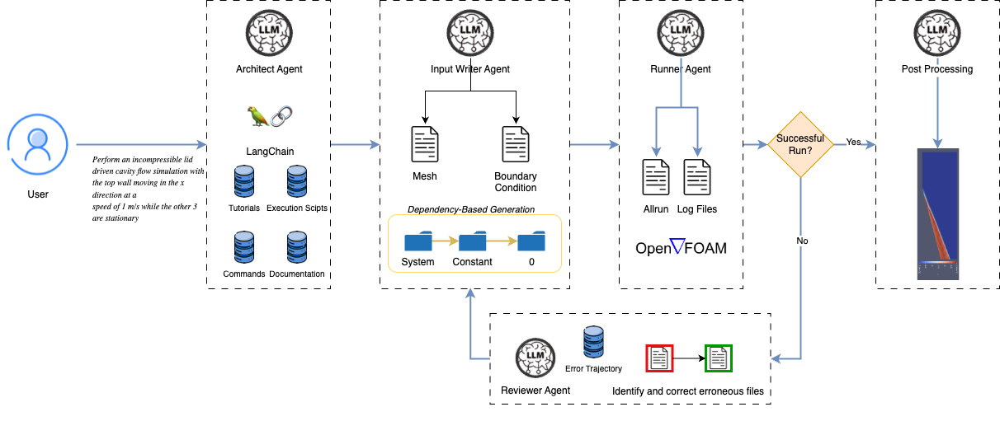

# Foam-Agent

<p align="center">
  
</p>

## Introduction
**Foam-Agent** is a multi-agent framework that automates complex OpenFOAM-based CFD simulation workflows from natural language inputs. By leveraging advanced AI techniques, Foam-Agent significantly lowers the expertise barrier for Computational Fluid Dynamics while maintaining modeling accuracy.

Our framework offers three key innovations:
- **Hierarchical multi-index retrieval system** with specialized indices for different simulation aspects
- **Dependency-aware file generation system** ensuring consistency across configuration files
- **Iterative error correction mechanism** that diagnoses and resolves simulation failures without human intervention

## Features
### 🔍 **Enhanced Retrieval System**
- **Hierarchical retrieval** covering case files, directory structures, and dependencies
- **Specialized vector index architecture** for improved information retrieval
- **Context-specific knowledge retrieval** at different simulation stages

### 🤖 **Multi-Agent Workflow Optimization**
- **Architect Agent** interprets requirements and plans file structures
- **Input Writer Agent** generates configuration files with consistency management
- **Runner Agent** executes simulations and captures outputs
- **Reviewer Agent** analyzes errors and proposes corrections

### 🛠️ **Intelligent Error Correction**
- **Error pattern recognition** for common simulation failures
- **Automatic diagnosis and resolution** of configuration issues
- **Iterative refinement process** that progressively improves simulation configurations

## Getting Started
Clone the repository and install dependencies:
```bash
git clone https://github.com/csml-rpi/Foam-Agent.git
cd Foam-Agent
conda env create -f environment.yml
```

## Citation
If you use Foam-Agent in your research, please cite our paper:
```bibtex
@article{yue2025foam,
  title={Foam-Agent: Towards Automated Intelligent CFD Workflows},
  author={Yue, Ling and Somasekharan, Nithin and Cao, Yadi and Pan, Shaowu},
  journal={arXiv preprint arXiv:2505.04997},
  year={2025}
}
```
